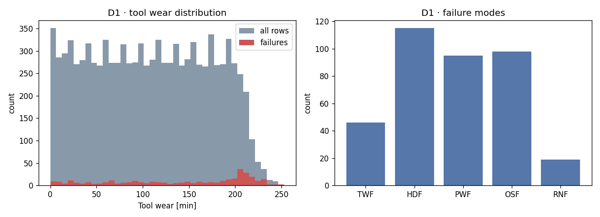
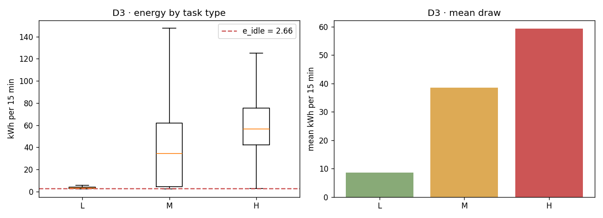

# T4.2 · EDA Summary

> Generated by `src/eda.py` on **2026-08-05**. Every number here feeds a specific parameter in `docs/04-framework-design.md`.

---

## D1 · AI4I 2020 Predictive Maintenance

- Rows: **10,000** · Columns: **14** · Missing values: **0**
- Overall failure rate: **3.39%** (339 failures)

> ⚠️ **AI4I 2020 is a *synthetic* dataset** (Matzka, 2020) built to reproduce the statistics of real milling-machine maintenance data. It is a standard public benchmark, but it is not a measurement log. The paper must therefore say *public benchmark datasets*, **not** *real-world datasets*, when describing D1. D3 (a Korean steel plant) and D4 (a semiconductor line) are real measurements.

### Failure modes

| Mode | Meaning | Count | Share of rows |
|---|---|---|---|
| TWF | Tool wear failure | 46 | 0.46% |
| HDF | Heat dissipation failure | 115 | 1.15% |
| PWF | Power failure | 95 | 0.95% |
| OSF | Overstrain failure | 98 | 0.98% |
| RNF | Random failure | 19 | 0.19% |

### Estimating L0 (nominal life, busy minutes) — design §3.1

| Population | n | mean wear | median | P5 | P95 | max |
|---|---|---|---|---|---|---|
| All rows | 10,000 | 108.0 | 108.0 | 10.0 | 206.0 | 253.0 |
| Any failure | 339 | 143.8 | 165.0 | 14.7 | 228.0 | 253.0 |
| Tool-wear failures (TWF) | 46 | 216.4 | 214.5 | 203.0 | 234.8 | 253.0 |

➜ **L0 = 216 busy-minutes** (TWF range 198-253 min).

What this means for task allocation, via `H(t+dt) = H - dt*kappa/L0`:

| Task | kappa | Minutes until H reaches 0 |
|---|---|---|
| L Light | 0.7 | **309 min** |
| M Medium | 1.0 | **216 min** |
| H Heavy | 1.4 | **155 min** |

➜ Continuous heavy work exhausts a machine **2x faster** than light work. This ratio is what gives the decision layer a data-grounded reason to rotate task types across machines.



---

## D3 · Steel Industry Energy Consumption

- Rows: **35,040** · Columns: **11** · Missing values: **0**
- Sampling interval: **15 minutes** (35,040 rows = 365 days x 96 intervals)

> Note: the sampling interval of this dataset (15 min) is identical to the decision epoch of the framework (15 min), so one row corresponds to exactly one epoch of machine energy use.

### Energy by load type — design §3.2

| D3 Load_Type | Framework task | n | mean kWh/15min | median | std | mean kW |
|---|---|---|---|---|---|---|
| Light_Load | **L** | 18,072 | 8.63 | 3.31 | 17.91 | 34.50 |
| Medium_Load | **M** | 9,696 | 38.45 | 34.44 | 35.22 | 153.78 |
| Maximum_Load | **H** | 7,272 | 59.27 | 56.63 | 29.75 | 237.06 |

> ⚠️ **Light_Load is strongly right-skewed** (mean/median = 2.6): that category mixes genuine idling with light production. The **mean** is used anyway, because energy is additive — total kWh over a shift is the sum of expected draws, and the median would systematically understate consumption and therefore CO2e. The median is reported above so the choice is visible.

➜ **e_idle = 2.66 kWh/15min** (P5 of Light_Load, outlier-robust floor)

| Task | delta_e (kWh/15min) | E = e_idle + delta_e |
|---|---|---|
| L | 5.97 | 8.63 |
| M | 35.79 | 38.45 |
| H | 56.61 | 59.27 |

➜ **Heavy work draws 6.9x the energy of light work.**

> ⚠️ Only this *ratio* is carried into the simulation. The absolute level is rescaled to the factory modelled here (`machines.energy_rescale_to_kwh_per_hour` in config.yaml), because a steel plant operates at a different scale. Every baseline uses the same rescaling, so the B1/B2/B3 comparison is unaffected.



---

## D4 · SECOM

- Shape: **1567 x 590** sensor features
- Missing values: **4.5%** of all cells
- Class balance: **93.4% pass / 6.6% fail** (104 failures)

➜ Baseline defect rate **6.64%**. This anchors the intercept b0 of the quality model so that a healthy machine operated by a skilled, unfatigued operator produces a realistic defect rate.

> ⚠️ SECOM's features are anonymised sensor readings with no operator attributes, so b2 (skill) and b3 (fatigue) **cannot** be fitted from it. Those two coefficients stay as specified in design §3.3 with their signs constrained positive, and are covered by the CP ablation (T7.8).

---

## Estimated parameters (also in `data/processed/eda_params.json`)

```json
{
  "L0_minutes": 216.4,
  "L0_range": [
    198.0,
    253.0
  ],
  "L0_basis": "mean tool wear at TWF events, AI4I 2020",
  "energy_interval_minutes": 15,
  "e_idle_kwh_per_interval": 2.66,
  "delta_e_kwh_per_interval": {
    "L": 5.966,
    "M": 35.785,
    "H": 56.605
  },
  "energy_ratio_H_over_L": 6.87,
  "secom_defect_rate": 0.0664
}
```